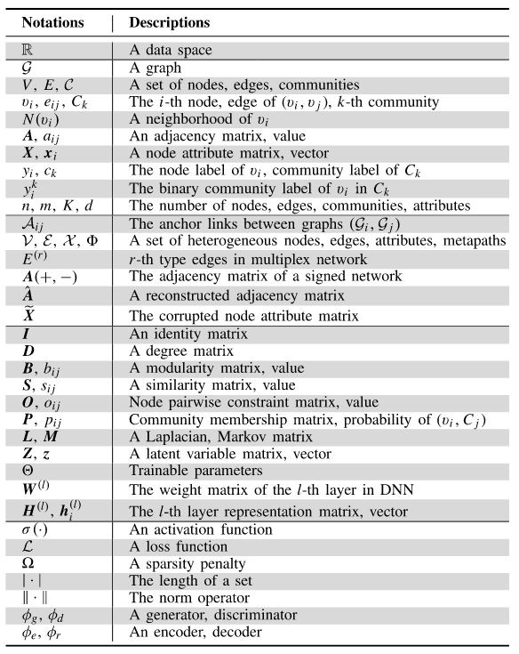

## Definitions and Preliminaries

* Definition 1 (Network)

    $\cal{G}$ $=(V, E)$, A basic network

    $V=\{v_1, ..., v_n\}$, the node set

    $E=\{e_{ij}\}^n_{i,j=1}$, the edge set

    $N(v_i)=\{u\in V|(v_i,u)\in E\}$, the neighborhood of a node $v_i$

    $A=[a_{ij}]$ denotes an $n\times n$ dimensional adjacency matrix, where $a_{ij}=1$ if $e_{ij} \in E$; otherwise, $a_{ij}=0$.

    If $a_{ij}\neq a_{ji}$, $\cal{G}$ is a *directed network* and an *undirected network* otherwise.

    If $a_{ij}$ is weighted by $w_{ij}\in W$, $\cal{G}$ $=(V,E,W)$ is a *weighted network* and *unweighted network* otherwise.

    If $a_{ij}$'s value differs in +1 (positive) and -1 (negative), $\cal{G}$ is a *signed network*[^1].

    If node $v_i \in V$ is attributed by $x_i \in X \subseteq \mathbb{R}^{n\times d}$, $\cal{G}$$=(V,E,X)$ is an *==attributed network==*; otherwise, it is an *unattributed network*[^2].

* Definition 2 (Community)

    $\cal{C}$$=\{C_1, C_2, ..., C_K\}$, a set of communities,

    Each community $C_k$ is a partition（划分） of $\cal{G}$ that has a regional structure（区域结构） and some cluster properties（聚类性质）.

    A node $v_i$ clustered into community $C_k$ should satisfy the condition that the internal node degree[^3] inside the community exceeds its external degree.

    Suppose $C_k \cap C_{k'}=\emptyset,(\forall k,k',k\ne k')$, $\cal{C}$ denotes *disjoint communities*; otherwise, *==overlapping communities==*.

* Community Detection Input

    the network topology and network attributes

* Community Detection Output

    a set of communities that can be either disjoint or overlapping

## Convolutional Network-Based Community Detection

* CNN-Based Community Detection

* GCN-Based Community Detection

    GCNs were designed for graph-structured data. The layer-wise propagation rule for a GCN is
    $$
    H^{(l+1)}=\sigma (\tilde{D}^{-\frac{1}{2}} \tilde{A} \tilde{D}^{-\frac{1}{2}} H^{(l)} W^{(l)})
    $$
    where the latent representations of the $l$ th layer are preserved in the matrix $H^{(l)} (H^{(0)})=X$ through an activation function $\sigma (\cdot)$ with a layer-specific trainable weight matrix $W^{(l)}$. Here, $\tilde{A}=A+I_n$, where $I_n$ denotes the identity matrix, and $\tilde{D}_{ii}=\sum_j\tilde{a}_{ij} \in \tilde{A}$.

    * Community clustering with unsupervised network representation.

## Hierarchical Networks

[^1]: 符号网络（Signed Network）是一种特殊类型的网络，其中不仅包含传统的无向或有向的边来表示实体（如人、组织、国家等）之间的关系，而且这些边带有正负符号，用以表示关系的类型是积极的（如友谊、合作）还是消极的（如敌意、竞争）。符号网络能够更准确地反映现实世界中的复杂关系，因为现实世界中的许多关系不仅仅是连接的存在与否，还包括连接的性质。 
[^2]: 属性网络（Attributed Network）是一种网络数据结构，其中节点（顶点）和/或边（连接线）不仅由其在网络中的位置定义，还由关联的属性（特征）定义。这些属性可以是各种类型的信息，如文本、数字、类别或任何可以描述节点或边的实值数据。
[^3]: 节点的度（Degree）是指与该节点直接相连的边的数量。它是描述节点连接水平的一个基本指标。
