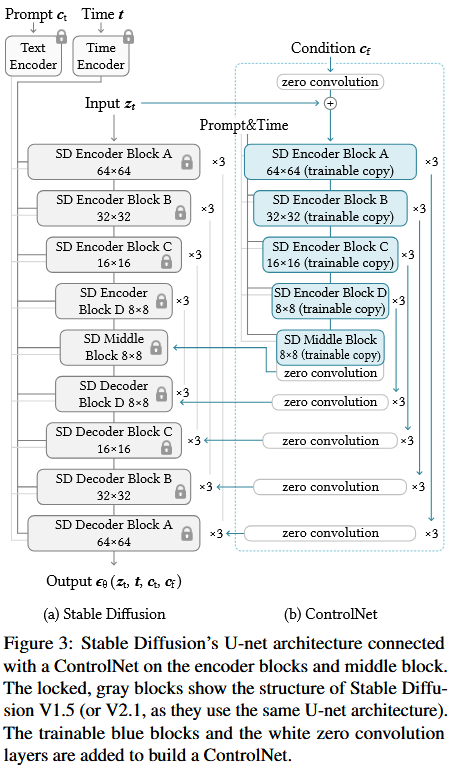

ControlNet, a neural network architecture to add spatial conditioning controls to large, pretrained text-to-image diffusion models.

## ControlNet

* Inject additional conditions into the blocks of a neural network.
  $$
  y = \cal{F}(x;\Theta),
  $$
  Suppose $\cal{F}(\cdot;\Theta)$ is a trained neural block, with parameters $\Theta$, that transforms an input feature map $x$, into another feature map $y$.

  Use two instances of zero convolutions with parameters $\Theta_{z1}$ and $\Theta{z2}$ respectively. The complete ControlNet then computes
  $$
  y_c = \cal{F}(x;\Theta)+\cal{Z}(x+Z(c;\Theta_{z1});\Theta_{z2}),
  $$
  where $y_c$ is the output of the ControlNet block.

  In the first training step, since both the weight and bias parameters of a zero convolution layer are initialized to zero, both of the $\cal{Z}(\cdot;\cdot)$ terms in the above equation to zero, and
  $$
  y_c = y.
  $$
  
  
  
  * *network block*: refer to a set of neural layers that are commonly put together to form a single unit of a neural network (e.g., resnet block, conv-bn-relu block, multi-head attention block, transformer block, etc)
  * *zero convolution*: 1x1 convolution with both weight and bias initialized to zero. It can protect the backbone by eliminating random noise as gradients in the initial training steps.
  * The locked parameters preserve the production-ready model trained with billion of images, while the trainable copy reuses such large-scale pretrained model to establish a deep, robust and strong backbone for handling diverse input conditions.

## ControlNet for Text-to-Image Diffusion

* Stable Diffusion

  

  * encoder (12 blocks), middle (1 block) ,decoder (12 blocks)
  * 8 blocks of it are down-sampling or up-sampling conv layers, while the other 17 blocks are main blocks (each contain 4 resnet layers and 2 Vision Transformers (Vits))
    * Vit: contain several cross-attention and self-attention mechanisms
  * Text prompts are encoded using the CLIP text encoder
  * Diffusion timesteps are encoded with a time encoder using positional encoding.

* ControlNet

  * Create a trainable of the 12 encoding blocks and 1 middle block of Stable Diffusion.
  * The outputs are adds to the 12 skip-connections and 1 middle block of the U-net.

* This approach speeds up training and saves GPU memory. As tested on a single **NVIDIA A100 PCIE 40GB**, optimizing Stable Diffusion with ControlNet requires only about 23% more GPU memory and 34% more time in each training iteration, compared to optimizing Stable Diffusion without ControlNet.

* To add ControlNet to Stable Diffusion:

  * Convert each input conditioning image (e.g., edge, pose, depth, *etc*) from an input size of 512x512 into a 64x64 feature space vector that matches the size of Stable Diffusion.

  * In particular, we use a tiny network $\cal{E}(\cdot)$ of **four conv layers with 4x4 kernels and 2x2 strides** (activated by **ReLU**, using **16, 32, 64, 128, channels** respectively, intitialized with **Gaussian weights** and trained jointly with the full model) to encode an image-space condition $c_i$ into a feature space conditioning vector $c_f$ as,
    $$
    c_f = \cal{E}(c{i}).
    $$
    The conditioning vectors $c_f$ is passed into the ControlNet.

## Training

* Given an input image $z_0$, image diffusion algorithms progressively add noise to the image and produce a noisy image $z_t$ (where $t$ represents the number of times noise is added)

* Given a set of conditions including time step $t$, text prompts $c_t$, as well as a task-specific condition $c_f$, image diffusion algorithms learn a network $\epsilon_\theta$ to predict the noise added to the noisy image $z_t$ with
  $$
  \cal{L} = \mathbb{E}_{z_0,t,c_t,c_f\sim\cal{N}(0,1)}\left[||\epsilon-\epsilon_\theta\left(z_t,t,c_t,c_f\right)||_2^2\right],
  $$
  where $\cal{L}$ is the overall learning objective of the entire diffusion model.

* In the training process

  * Randomly replace 50% text prompts $c_t$ with empty strings.

    The approach increases ControlNet's ability to directly recognize semantics in the input conditioning images (*e.g.*, edges, poses, depth, *etc.*) as a replacement for the prompt.

  * Since zero conv do not add noise to the network, the model should always be able to predict high-quality images.

  * Sudden convergence phenomenon

    Observe that the model does not gradually learn the control conditions but abruptly succeeds in following the input conditioning images.

## Inference

2 way to control the extra conditions of ControlNet affect denoising diffusion process

* Classifier-free guidance resolution weighting.

* Composing multiple ControlNets.

  

  * Apply multiple conditioning images (e.g., depth and pose) as a replacement for the prompt.

  * Directly add the outputs of the corresponding ControlNets to the Stable Diffusion model. (No extra weighting or linear interpolation in necessary for such composition)
