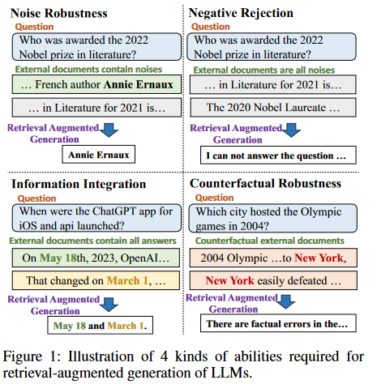

## Evaluation of Retrieval-Augmented Generation: A Survey

* Auepora, A Unified Evaluation Process of RAG.

* What to Evaluate? (Target)

    The combination of "Evaluable Outputs" (EOs) and "Ground Truths" (GTs) in the RAG system can generate all possible targets.

    * Retrieval
        * Relevance
        * Accuracy
    * Generation
        * Relevance
        * Faithfulness
        * Correctness

* How to Evaluate? (Dataset)

* How to Measure? (Metric)

    * Retrieval Metrics
        * 

    * Generation Metrics

* 感觉没得看

### RAGAS: Automated Evaluation of Retrieval Augmented Generation

* Contributions

    Introduce RAGAs, a framework for reference-free evaluation of RAG pipeline. 无基准评估框架

    https://github.com/explodinggradients/ragas

    ==Provides an integration with both llamaindex and Langchain.==

    Put forward a suite of metrics, without having to rely on ground truth human annotations.

* 对现有研究说明

    RAG的实施需要大量调整，因此自动评估至关重要。

* A standard RAG setting

    a question $q$

    the system first retrieves some context $c(q)$

    and then uses the retrieved context to generate an answer $a_s(q)$.

* 3 Quality Aspects

    * Faithfulness: the answer should be grounded in the given context.

        We say that the answer $a_s(q)$ is faithful to the context $c(q)$ if the claims that are made the answer can be inferred from the context. 

        1. Use an LLM to extract a set of statements, $S(a_s(q))$.

            ```python
            """
            Given a question and answer, create one or more statements from each sentence in the given answer.
            question: [question]
            answer: [answer]
            """
            ```

            The aim of this step is to decompose longer sentences into shorter and more focused assertions.

        2. For each statement $s_i$ in $S$, the LLM determines if $s_i$ can be inferred from $c(q)$ using a verification function $v(s_i,c(q))$.

            ```python
            """
            Consider the given context and following statements, then determine whether they are supported by the information present in the context. Provide a brief explanation for each statement before arriving at the verdict (Yes/No). Provide a final verdict for each statement in order at the end in the given format. Do not deviate from the specified format.
            statement: [statement 1]
            ...
            statement: [statement n]
            """
            ```

        3. The final faithfulness score, $F$, is then computed as $F = \frac{|V|}{|S|}$, where $\abs{V}$ is the number of statements that were supported according to the LLM and $\abs{S}$ is the total number of statements.

    * Answer Relevance: the generated answer should address the actual question that was provided.

        (Our assessment of answer relevance does **not take into account factuality**, but penalises cases where the answer is incomplete or where it contains redundant information.)

        We say that the answer $a_s(q)$ is relevant if it directly addresses the question in an appropriate way. 

        1. To estimate answer relevance, for the given answer $a_s(q)$, we prompt the LLM to generate $n$ potential question $q_i$ based on $a_s(q)$.

            ```python
            """
            Generate a question for the given answer.
            answer: [answer]
            """
            ```

        2. Obtain embeddings for all questions using the `text-embedding-ada-002` model, available from the OpenAI API. For each $q_i$, we calculate the cosine similarity $\rm{sim} (q,q_i)$ with the original question $q$,.

        3. The answer relevance score, AR, for question $q$ is then computed as :
            $$
            \rm{AR} = \frac{1}{n}\sum\limits^{n}_{i=1}sim(q,q_i)
            $$

    * Context Relevance: the retrieved context should be focused, containing as little irrelevant information as possible. 检索到的内容是聚焦的，包含尽可能少的无关信息

        The context $c(q)$ is considered relevant to the extent that it exclusively contains information that is needed to answer the question. (This metric aims to penalise the inclusion of redundant information)

        1. Given a question $q$ and its context $c(q)$, the LLM extracts a subset of sentences, $S_{ext}$, from $c(q)$ that are crucial to answer $q$.

            ```python
            """
            Please extract relevant sentences from the provided context that can potentially help answer the following question. If no relevant sentences are found, or if you believe the question cannot be answered from the given context, return the phrase "Insufficient Information". While extracting candidate sentences you’re not allowed to make any changes to sentences from given context.
            """
            ```

        2. The context relevance score is then computed as:
            $$
            \rm{CR} = \frac{number\;of\;extracted\;sentences}{total\;number\;of\;sentences\;in\;c(q)}
            $$

* The WikiEval Dataset

* My opinion

    阅读到目前为止，觉得这个评估方法是比较容易实现的，实现步骤论文中已经讲得很清楚了。但是我认为提到得评估维度和指标还是略微粗浅了。

    在评估维度方面，虽然提到了检索到的内容应该是聚焦的，但是无法判断是否检索到了知识库中最相关的内容。

    在指标方面，特别是最后一个上下文相关度的评分。我觉得太抽象了。要是LLM把多个相关的内容都写进了一个句子里，就完全不准确了。

    还有一点就是结合了微软的 GraphRAG 论文里说的，没有办法评价 RAG 模型对知识库中知识的概括能力。

## Benchmarking Large Language Models in Retrieval-Augmented Generation



Establish RGB, a new corpus for RAG evaluation in both English and Chinese.

* 4 Specific Abilities

    * Noise Robustness

        As retrievers are not perfect, the external knowledge they retrieve often contains a significant amount of noise. LLMs must be able to extract the necessary information.

    * Negative Rejection

        In real-world situations, the search engine often fails to retrieve documents containing the answers. The model should have the capability to reject recognition and avoid generating misleading content.

    * Information Integration

        In many cases, the answer to a question may be contained in multiple documents.

    * Counterfactual Robustness

        In the real world, there is an abundance of false information on the internet.

* Evaluation Metrics

    * Accuracy %

        measure noise robustness and information integration

        Employ an exact match approach where if the generated text contains an exact match to the answer, it is considered as a correct answer.

    * Rejection rate %

        measure negative rejection

        When only noisy documents are provided, if the model generates "I can not answer the question ...", it indicates a successful rejection.

    * Error detection rate %

        measure whether the model can detect the factual errors in the documents for counterfactual robustness

        When the provided documents contain factual errors, if the model generates "There are factual errors in the provided documents", it indicates that the model has detected erroneous information in the document.

    * Error correction rate %

        measure whether the model can provide the correct answer after identifying errors for counterfactual robustness

        After identifying the factual errors, if the model generates the correct answer, it indicates that the model is capable of correcting errors in the document.

* My Opinion

    模型的能力很有道理，但是都用百分比作为指标，太粗糙了。

    同样也无法评估概括性的问题。

## Evaluating Retrieval Quality in Retrieval-Augmented Generation

* 对现有研究的说明

    End-to-end evaluation lacks transparency, resource-intensive. Many ranking systems rely on interleaving for evaluation and optimization.

    Human annotations: accurate annotations are often challenging and costly to obtain.

    A lack of meaningful relationship between the evaluated metrics and the downstream performance of RAG.

* Propose eRAG, a new approach for evaluating retrievers in RAG systems.

* 不想看


##   Is ChatGPT a Good NLG Evaluator ?

* NLG Metrics

    * $n$-gram-based Metrics

        Aim to measure the lexical overlap between a generated text and a reference text.

        The standard $n$-gram overlap-based metrics generally include ROUGE, BLUE, Distinct-n and METEOR.

        * ROUGE is the dominant metric in the summarization evaluation area. 是文摘评价领域的主导度量
        * BLUE metric is the common practice for the machine translation evaluation area.

    * Embedding-based Metrics

        * WMD based on the word embedding
        * BERTScore and MoverScore based on the sentence embeddings

    * LLM-based Metrics

    * ...

* ChatGPT for NLG Evaluation

    * Reference-free Metric

        Regard ChatGPT as a human evaluator and give it evaluation instruction via different prompts. Each  prompt should specify (1) which NLG task (e.g., summarization) needs to be evaluated and (2) which aspect (e.g., fluency) of the generation result should be assessed currently.

        Where `[task-ins]` and `[aspect-ins]` are the instruction of the current task and aspect, respectively.

        `[aspect]` and `[ant-aspect]` denote the evaluated aspect and its antonym, respectively.

        `[Conditioned Text]` is the input of NLG models while `[Generated Text]` is the output.

        * Direct assessment (DA)

            ```python
            """
            Score the following [task-ins] with respect to [aspect] on a continuous scale from 0 to 100, where a score of zero means “[ant-aspect]” and score of one hundred means “perfect [aspect]”. Note that [aspect] measures [aspect-ins].
            
            [Conditioned Text]
            [Generated Text]
            Scores:
            """
            ```

            For example, when evaluating news summarization models in terms of fluency, the DA prompt may be like this:

            ```python
            """
            Score the following [news summarization given the corresponding news] with respect to [fluency] on a continuous scale from 0 to 100, where a score of zero means "[disfluency]" and score of one hundred means "perfect [fluency]". Note that [fluency] measures [the quality of individual sentences, are they well-written and grammatically correct. Consider the quality of individual sentences].
            
            News: [a news article] 
            Summary: [one generated summary] 
            Scores:
            """
            ```

        * One-to-five stars ranking (star)

            ```python
            """
            Score the following [task-ins] with respect to [aspect] with one to five stars, where one star means “[ant-aspect]” and five stars means “perfect [aspect]”. Note that [aspect] measures [aspect-ins].
            
            [Conditioned Text]
            [Generated Text]
            Stars:
            """
            ```

    * Reference-based Metric

        Explicitly mention the golden references in the prompts.

        * DA

            ```python
            """
            Score the following [task-ins] with respect to [aspect] on a continuous scale from 0 to 100, where a score of zero means “[ant-aspect]” and score of one hundred means “perfect [aspect]”. Note that [aspect] measures [aspect-ins].
            
            [Conditioned Text]
            Human reference: [A Reference] 
            [Generated Text] Scores:
            """
            ```

        * star

            ```python
            """
            Score the following [task-ins] with respect to [aspect] with one to five stars, where one star means “[ant-aspect]” and five stars means “perfect [aspect]”. Note that [aspect] measures [aspect-ins]. 
            
            [Conditioned Text]
            Human reference: [A Reference] 
            [Generated Text] Stars:
            """
            ```

* Experiments

    * Experimental Setup

        * Metrics

            Adopt 3 widely-used correlation measures.

            1. Spearman correlation: assess the montonic relationships between two variables 评估两个变量之间的单调关系
            2. Pearson correlation: measure the linear relationships between two sets of data
            3. Kendall's Tau: evaluate the ordinal association between two measured quantities 评价两个测量量之间的有序关联

        * Evaluation Strategy

            When calculating the correlation scores, there are different aggregation methods.

            Given a set of conditioned text $\{c_1,c_2,...,c_n\}$ (e.g., source documents in text summarization task) and $M$ NLG models. The generated text of $m$-th model for the $i$-th condition text is denoted as $g_{i,m}$.

            1. *Sample-level* evaluation strategy calculates the correlation scores as follows:
                $$
                \rm{Corr_{sample}} = \frac{1}{n}\sum\limits_{1}^{n}(\rho ([\mathit{f}_{auto}(g_{i,1}),...,\mathit{f}_{auto}(g_{i,M})],[\mathit{f}_{human}(g_{i,1}),...,\mathit{f}_{human}(g_{i,M})]))
                $$
                where $\rho$ denotes the correlation metrics like Spearman collelation. $\mathit{f}_{auto}$ and $\mathit{f}_{human}$ indicate the automatic evaluation and human judgment functions, respectively.

            2. *Dataset-level* evaluation strategy calculates the correlation as follows:
                $$
                \rm{Corr_{dataset}} =\rho ([\mathit{f}_{auto}(g_{1,1}),...,\mathit{f}_{auto}(g_{n,M})],[\mathit{f}_{human}(g_{1,1}),...,\mathit{f}_{human}(g_{n,M})])
                $$

* Conclusion

    * 论文得出结论，ChatGPT 有潜力作为一个通用的、可靠的 NLG 评估指标。
    * 作者指出，ChatGPT 作为评估器的性能受到提示（prompt）设计的显著影响，不同的任务或方面需要精心设计的提示。
    * 论文还指出了 ChatGPT 作为 NLG 评估指标的局限性，并提出了未来工作的方向，包括探索更强大的提示、扩展到其他主流 NLG 任务和语言、以及在更具挑战性的数据集上测试 ChatGPT 评估器的性能。

## LLM as a Judge

传统基准和开放式问题的错位 underscores the core problem driving this paper: the need for a robust and scalable automated method to evaluate LLM alignment with human preferences. 需要一种稳健的、可扩展的自动化评估方法来评估LLM与人类偏好的一致性

* Types of LLM-as-a-Judge

    * Pairwise comparison

        An LLM judge is presented with a question and two answers, and tasked to determine which one is better or declare a tie.

        This method may lack scalability when the number of players increases, given that the number of possible pairs grows quadratically.

    * Single answer grading

        An LLM judge is asked to directly assign a score to a single answer.

        Single answer grading may be unable to discern subtle differences between specific pairs, and its results may become unstable, as absolute scores are likely to fluctuate more than relative pairwise results of the judge model changes.

    * Reference-guided grading

        Provided a reference solution.

* Advantages of LLM-as-a-Judge

    * Scalability 可扩展性

        It reduces the need for human involvement, enabling scalable benchmarks and fast iterations.

    * Explainability 可解释性

        LLM judges provide not only scores but also explanations, making their outputs interpretable.

* Limitations of LLM-as-a-Judge

    * Position bias 位置偏见

        Position bias is when an LLM exhibits a propensity to favor certain positions over others. This bias is not unique to our context and has been seen in human decision-making and other ML domains. 位置偏见是指LLM表现出对某些位置的偏爱

        e.g.

        When GPT-3.5's answer is positioned first, GPT-4 considers GPT 3.5's answer more detailed and superior. However, upon switching the position of the two responses, GPT-4's judgment flips, favoring Vicuna's answer.

    * Verbosity bias 多义性偏误

        Verbosity bias is when an LLM judge favors longer, verbose responses, even if they are not as clear, high-quality, or accurate as shorter alternatives.

    * Self-enhancement bias

        LLM judges may favor the answers generated by themselves.

    * Limited capability in grading math and reasoning questions

* Addressing limitations

    * Swapping positions

        Call a judge twice by swapping the order of two answers and only declare a win when an answer is preferred in both orders. If the results are inconsistent after swapping, we can call it a tie.

        Another more aggressive approach is to assign positions randomly, which can be effective at a large scale with the correct expectations.

    * Few-shot judge

        The few-shot judge can significantly increase the consistency. However, high consistency may not imply high accuracy and we are not sure whether the few-shot examples will introduce new bias.

    * Chain-of-thought and reference-guided judge

        在有思维链的情况下，LLM judge还是会受到错误答案的影响。

        In the reference-guided method we first generate LLM judge's answer independently, and then display it as a reference answer in the judge prompt. 这种方法显著降低了失败率。

    * Fine-tuning a judge model

    
