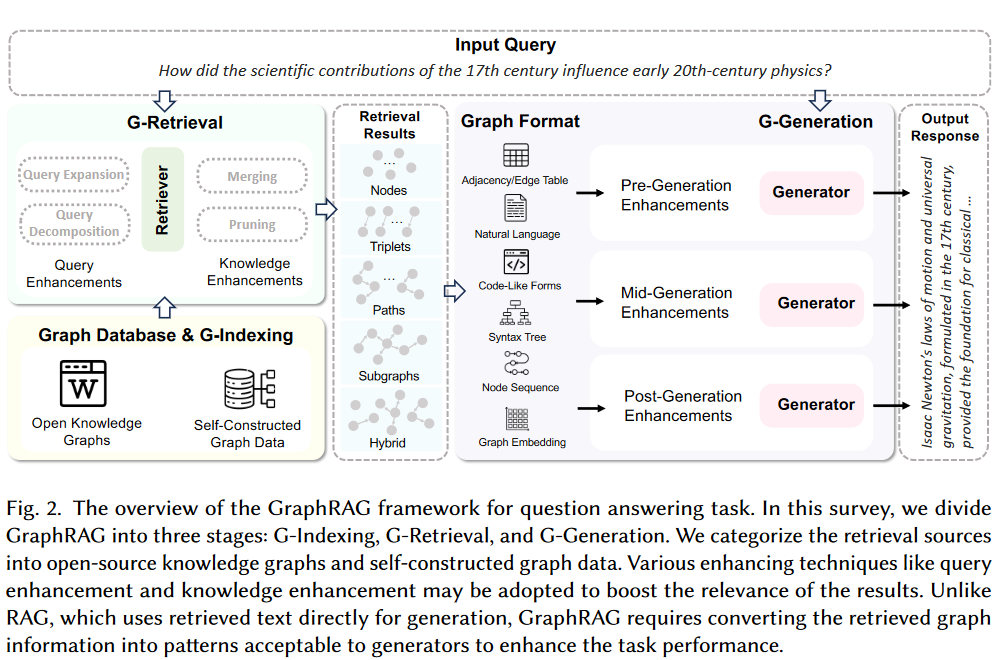
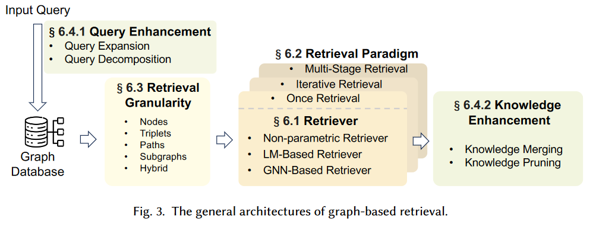
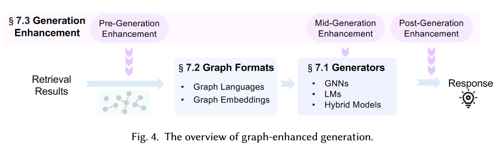
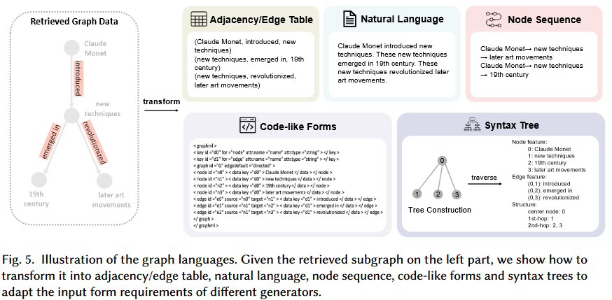

## Background

* LLM's remarkable language comprehension and text generation capabilities

* LLM's limitations

    * a lack of domain-specific knowledge
    * real-time updated information
    * proprietary information

    lead to a phenomenon knowns as "hallucination"

* RAG

    supplement LLMs with external knowledge to mitigate this problem

    aims to enhance the quality and relevance of generated content by integrating a retrieval component within the generation process

    * limitations
        * Neglecting Relationships 忽视关系: Traditional RAG fails to capture significant structured relational knowledge that cannot be represented through semantic similarity alone. 传统的RAG无法捕获仅通过语义相似度无法表示的重要结构化关系知识。
        * Redundant Information 冗余信息: RAG often recounts content in the form of textual snippets when concatenated as prompts. This makes context become excessively lengthy, leading to the “lost in the middle” dilemma.
        * Lacking Global Information

* GraphRAG

    GraphRAG retrieves graph elements containing relational knowledge pertinent to a given query from a pre-constructed graph database. These elements may include nodes, triples, paths, or subgraphs, which are utilized to generate responses.

    * consider the interconnections between texts, enabling a more accurate and comprehensive retrieval of relational information
    * offer abstraction and summarization of textual data, thereby significantly shortening the length of the input text and mitigating concerns of verbosity
    * by retrieving subgraphs or graph communities, access comprehensive information to effectively address the QFS challenge by capturing the broader context and interconnections within the graph structure.

## Preliminaries

### Text-Attributed Graphs

One typical kind of TAGs is Knowledge Graph (KGs), where nodes are entities, edges are relations among entities, and text attributes are the names of entities and relations.

## GraphRAG Workflow

### Graph-Based Index (G-Indexing)

* Graph Data

* Indexing

    * graph indexing

        the most commonly used approach

        During subsequent retrieval stages, classic graph search algorithm such as BFS and Shortest Path Algorithms can be employed to facilitate retrieval task.

    * text indexing 

        Text indexing involves converting graph data into textual descriptions to optimize retrieval processes.

        Some methods convert subgraph-level information into textual descriptions. For example, [Edge et al.](#From Local to Global: A Graph RAG Approach to Query-Focused Summarization) perform community detection on the graph and generate summaries for each community using LLMs.

    * vector indexing

        Vector indexing transforms graph data into vector representations to enhance retrieval efficiency.

    In practical applications, a hybrid approach combining these indexing methods is often preferred over relying solely on one.

### Graph-Guided Retrieval (G-Retrieval)

Two significant challenges

（1）Explosive Candidate Subgraphs

（2）Insufficient Similarity Measurement

#### Retrieval Enhancement

* Query Enhancement

    * Query Expansion

        query: short length, limit information content

        Query expansion aims to improve search results by supplement or refining the original query with additional relevant terms or concepts.

        * generate relation paths grounded by KGs with LLMs to enhance the retrieval relevant terms or concepts.
        * adapt SPARQL to get all the aliases of the query entities from Wikidata
        * a consensus-view knowledge retrieval method, which first discover sematically relevant queries, and then re-weight the original query terms
        * utilize a large model to generate the hypothesis output of the question, concatenating the hypothesis output with the query as input to the retriever

    * Query Decomposition

        Query decomposition techniques break down or decompose the original user query into smaller, more specific sub-queries.

        Each sub-query typically focuses on a particular aspect or component of the original query. For instance, break down the primary question into sub-sentences, each representing a distinct relation, and sequentially retrieves the pertinent triplets for each sub-sentence.

* Knowledge Enhancement

    Knowledge enhancement strategies are employed to refine and improve the retriever's results. These techniques aim to ensure that the final set of retrieved results is not only comprehensive but also highly relevant to the user's information needs.

    * Knowledge Merging

        Knowledge merging retrieved information enables compression and aggregation of information, which assists in obtaining a more comprehensive view by consolidating relevant details from multiple sources.

        mitigate issues related to input length constraints in models 缓解了模型中与输入长度约束相关的问题

        * merge nodes and condense the retrieved sub-graph through triple aggregation to enhance the reasoning efficiency
        * merge the same entities from different subgraphs to form the final subgraph
        * merge retrieved subgraphs based on relations, combining head entities and tail entities that satisfy the same relation into two distinct entity sets, ultimately forming a relation paths 合并检索到的基于关系的子图，将满足相同关系的头实体和尾实体合并为两个不同的实体集合，最终形成关系路径

    * Knowledge Pruning

        Knowledge pruning involves filtering out less relevant or redundant retrieved information to refine the results.

        Previous approaches: (re)-ranking based approaches and LLM-based approaches.

        * Introduce stronger models for reranking: concatenate each retrieved triplet with the question-choice pair, and adapt a pre-trained cross-encoder to re-rank the retrieved triplets 将每个检索到的三元组与问题选择对进行拼接，并采用预训练的交叉编码器对检索到的三元组进行重排序

        * Utilize the similarity between queries and retrieved information for ranking: 

            Re-rank the candidate subgraphs based on the similarity for both relation and fine-grained concept between subgraphs and the query.

            First cluster the 2-hop neighbors and then delete the cluster with the lowest similarity score with the input query.

            Prune the retrieved subgraph according to the relevance score between the question context and the KG entity nodes calculated by a pre-trained language model. 根据问题上下文与预训练语言模型计算的KG实体结点之间的相关性得分，对检索到的子图进行剪枝

            Adapt Personalized PageRank algorithm to rank the retrieved candidate information for further filtering.

            First divide the retrieved subgraph into several smaller subgraphs, then compare the similarity between each smaller subgraph and the query. Subgraphs with low similarity are removed, and the remaining smaller subgraphs are merged into a larger subgraph.

        * Propose new metrics for reranking:

            Propose a metric that measure both the impact and recency of the retrieved text chunks.

            Decompose the retrieved paths into triplets and reranks the paths based on the confidence score measured by the knowledge graph embedding (KGE) techniques. 将检索到的路径分解为三元组，并基于知识图谱嵌入（KGE）技术度量的置信度得分对路径进行重新排序

            Prune the irrelevant graph data by calling LLMs to check. 通过调用LLMs进行校验，对不相关的图数据进行剪枝

#### Retrieval Granularity

* Nodes
* Triplets
* Paths
* Subgraphs
* Hybrid Granularties

#### Retriever

* Non-parametric Retriever

    Based on heuristic rules or traditional graph search algorithms exhibit good retrieval efficiency, but may suffer from inaccurate retrieval due to the lack of training on downstream tasks.

* LM-based Retriever

    discriminative and generative language model

    * Expand from the topic entity and retrieve the relevant paths in a sequential decision process.
    * Adapt LLMs to generate the set of top-K relevant relations of the specific entity.
    * Utilize fine-tuned LLM to generate reasoning paths.
    * Utilize LLMs to automatically invoke several pre-defined functions, by which relevant information can be retrieved and combined to assist further reasoning.

* GNN-based Retriever

    GNN-based retrievers typically encode graph data and subsequently score different retrieval granularities based on their similarity to the query.

    * First encode the graph, assign a score to each entity, and retrieve entities relevant to the query based on a threshold.
    * Iterate multiple times to retrieve relevant paths. During each iteration, it first uses LLM to select edges connecting the current node, then employ GNNs to obtain embeddings of the new layer of nodes for the next round of LLM selection.

Considering this complementarity, many methods propose hybrid retrieval approaches to improve both retrieval efficiency and accuracy.

#### Retrieval Paradigm 检索范式

* Once retrieval

    Aim to gather all pertinent information in a single operation.

    * Utilize embedding similarities to retrieve the most relevant pieces of information.
    * Design pre-defined rules or patterns to directly extract specific structured information such as triples, paths or subgraphs from graph databases. 通过设计预定义的规则或模式，直接从图数据库中抽取特定的结构化信息，如三元组、路径或子图等

    We also include some multiple retrieval methods that involve decoupled and independent retrievals, allowing them to be computed in parallel and executed only once. 还包括一些设计解耦和独立检索的多种检索方法，允许它们并行计算，并且只执行一次

    * First instruct LLMs to generate multiple reasoning paths and then use a BFS retriever to sequentially search for subgraphs in the knowledge graph that match each path.
    * Decompose the original query into several sub-queries, retrieving relevant information for each sub-query in a single retrieval process.

* Iterative retrieval

    Conduct further searches based on previously retrieved information, progressively narrowing down to the most relevant results.

    * Non-adaptive retrieval

        Non-adaptive methods typically follow a fixed sequence of retrieval, and the termination of retrievals is determined by setting a maximum time or a threshold.

        * Retrieve problems-relevant subgraphs through *T* iterations. In each iteration, the paper designs a retrieval rule to select a subset of retrieved entities, and then expands these entities by searching relevant edges in the knowledge graph.
        * In each iteration, first select seed nodes based on the similarity between the context and the nodes in the graph. Then, use LLMs to summarize and update the context of the neighboring nodes of the seed nodes, which is utilized in the subsequent iteration.

    * Adaptive retrieval

        Let models autonomously determine the optimal moments to finish the retrieval activities.

        * Leverage on LM for hop prediction, which serves as an indicator to end the retrieval.

        Utilize model-generated special tokens or texts as termination signals for the retrieval process.

        * ToG prompts the LLM agent to explore the multiple possible reasoning paths until the LLM determines the question can be answered based on the current reasoning path.
        * Train a RoBERTa to expand a path from each topic entity. In the process, a virtual relation named as "[END]" is introduced to terminate the retrieval process.

        Treating the large model as an agent, enabling it to directly generate answers to questions to signal the end of iteration.

        * Propose LLM-based agents to reason on graphs. These agents could autonomously determine the information for retrieval, invoke the pre-defined retrieval tools, and cease the retrieval process based on the retrieved information.

* Multi-stage retrieval

    Multi-stage retrieval divides the retrieval process linearly into multiple stages, with additional steps such as retrieval enhancement, and even generation process occurring between these stages. 多阶段检索将检索过程线性地划分为多个阶段，并在这些阶段之间进行检索增强灯附加步骤，甚至生成过程。

    * First utilize a non-parametric retriever to extract n-hop paths of entities in the query's reasoning chain, then after a pruning stage, it further retrieves the one-hop neighbors of the entities in the pruned subgraph.
    * Divide the retrieval process into two stages. In the first stage, it retrieves all 1-hop neighbors of the topic entity. In the second stage, it compares the similarity between these neighbor nodes and other nodes, selecting the top-k nodes with the highest similarity for retrieval.
    * First employ GNNs to retrieve the top-k nodes most likely to be the answer. Subsequently, it retrieves all shortest paths between query entities and answer entities pairwise.

### Graph-Enhanced Generation (G-Generation)

#### Generation Enhancement

* Pre-generation enhancement

    Focus on improving the quality of input data or representations before feeding them into generator.

    Semantically enrich the retrieved graph data.

    * Employ LLMs to rewrite retrieved graph data, enhancing the naturalness and semantic richness of the transformed natural language output.
    * Utilize teh retrieved graph data to rewrite the query.
    * First leverage LLMs to generate a reasoning plan and answer queries according to the plan.
    * Extract all nouns from the QA pairs (or the QA pairs themselves) and insert them as nodes into the retrieved subgraph.
    * Prior to generation, decompose the representation of the query into multiple vectors termed "instructions", each representation different features of the query. These instructions are used as conditions during message passing when applying GNNs to learn from retrieved subgraphs.

    Incorporate additional information beyond graph data.

    * Incorporate documents relevant to entities.
    * Retrieve other related questions.

* Mid-generation enhancement

    Techniques applied during the generation process.

    Typically adjust the generation strategies based on intermediate results or contextual cues. 根据中间结果或上下文线索来调整生成策略

    * Introduce constrained decoding to control the output space and reduce generation errors.

    Adjust the prompts of LLMs to achieve multi-step reasoning.

    * Not only produce answer but also generate the reasoning process.

* Post-generation enhancement

    Occur after the initial response is generated.

    Integrate multiple generated response to obtain the final response.

    Integrate outputs from the same generator under different conditions or inputs.

    * ==Generate a summary for each graph community, followed by generating responses to queries based on the summary, and then scoring these response using an LLM. Ultimately, the responses are sorted in descending order according to their scores and sequentially incorporated into the prompt until the token limit is reached. Subsequently, the LLM generate the final response.==
    * First decompose the query into several sub-questions, then generate answers for each sub-question, and finally merge the answers of all sub-question to obtain the final answer.

    Combine the outputs or select responses generated by different models.

    * combine the outputs generated by both GNNs and LLMs to reach a synergistic effect.

    * explore two methods for generating answers: one involves generating directly generates in Cypher Query Language to execute and obtain results, while the other method directly generates answers based on retrieved triplets. The final answer is determined through a dynamic selection mechanism.
    * besides the learned scoring function, researchers additionally design a rule-based score based on the graph structures. These two scores are combined to find the answer entity
    * combine answers based on retrieved graph data with responses generated according to the LLM’s own knowledge.

#### Graph Formats

Graph translators are employed to convert the graph data into a format compatible with LMs.

* Graph Languages

    > Good Graph Languages
    >
    > * Complete 完整的: capture all essential information within the graph structure, ensuring no critical details are omitted.
    >
    > * Concise 简洁的: avoid the "lost in the middle" phenomenon or exceeding the length limitations of LMs.
    >
    > * Comprehensible 可理解的: ensure that the language used is easily understood by LLMs

    * Adjacency / Edge Table

        The adjacency table enumerates the immediate neighbors of each vertex.

        * linearize the triples in the retrieved subgraph, which are then concatenated and fed into the LLMs.

        The edge table details all the edges within the graph.

    * Natural Language

        Considering the outstanding natural language comprehension capabilities of LMs.

        Describe the retrieved graph data using natural language.

        * Define a natural language template for each type of edge in advance and subsequently filling in the endpoints of each edge into the corresponding template based on its type.
        * Employ natural language to describe the information of 1-hop and 2-hop neighboring nodes of the central node.
        * ==Adopt LMs to rewrite the edge table of retrieved subgraphs, generating a natural language description.==
        * Explore different representations of nodes (e.g., Integer encoding, alphabet letters, names, etc.) and edges (e.g., parenthesis, arrows, incident, etc.)
        * Integrate information from different granularities within the graph into prompts through natural language in the form of dialogue

    * Code-Like Forms

        Natural descriptions and other 1-D sequences are inherently inadequate for directly representing the 2-D structure of graph data.

        Given the robust code comprehension capabilities of LMs.

        * Graph Modeling Language (GML)
        * Graph Markup Language (GraphML)

        These standardized languages are specifically designed for graph data, providing comprehensive descriptions that encompass nodes, edges, and their interrelationships. 

    * Syntax Tree

        Syntax trees possess a hierarchical structure and maintain a topological order.

        * Transform the ego network of a central node into a graph-syntax tree format. This format not only encapsulates structural information but also integrates the features of the nodes. By traversing this syntax tree, it is possible to obtain a node sequence that maintains both topological order and hierarchical structure.

    * Node Sequence

        Node Sequences are often generated using predefined rules.

        Compared to natural language descriptions, these node sequences are more concise and incorporate prior knowledge, specifically the structural information emphasized by the rules.

        * Transform the retrieved paths into node sequences and input them into an LLM to enhance the task performance

        * ==The Neighborhood Detail Template: offers a detailed examination of the central node along with its immediate surroundings. 提供了对中心节点和它的直接周边环境的详细检查==

            ==The Hop-Field Overview Template, provides a summarized perspective of a node’s neighborhood, which can be expanded to encompass broader areas. 提供了一个节点邻域的总结视角，可以扩展到更广泛的领域==

        * Inputs the retrieved reasoning paths into LMs in the form of node sequences as prompts.

#### Generators

Generators

* GNNs (暂不研究)

* LMs

    Encoder-only models, primary use in discriminative tasks.

    Encoder-decoder and decoder-only models are adapt at both discriminative and generative tasks.

* Hybrid Models (暂不研究)

## Training

### Training Strategies of Retriever

* Training-Free

    * Non-parametric retrieves: rely on pre-defined rules or traditional graph search algorithms rather than specific models.

    * Utilize pre-trained LMs as retrieves

        Utilize pre-trained embedding models to encode the queries and perform retrieval directly based on the similarity between the query and graph elements.

        Adopt generative language models.

* Training-based

## Evaluation

* downstream task evaluation (generation quality)

    * KBQA

        Exact Match (EM), F1 score: commonly used to measure the accuracy of answering entities.

        BERT4Score, GPT4Score: mitigate instances where LLMs generate entities that are synonymous with the ground truth but not exact matches.

    * CSQA

        Accuracy, BLEU, ROUGE-L, METEOR

* retrieved quality

    coverage of answers / the size of the retrieval subgraph....

    

## Future Research Directions

* Dynamic and Adaptive Graphs

    Most GraphRAG methods are built upon static databases; however, as time progresses, new entities and relationships inevitably emerge.

* Multi-Modality Information Integration

    Most knowledge graphs primarily encompass textual information, thereby lacking the inclusion of other modalities such as images, audio, and videos, which hold the potential to significantly enhance the overall quality and richness of the database.

* Scalable and Efficient Retrieval Mechanisms

* Combination with Graph Foundation Model

* Lossless Compression of Retrieved Context

    remove redundant information and compress lengthy sentences into shorter

    目前的工作只进行了权衡

* Standard Benchmarks

* Boarder Application

### From Local to Global: A Graph RAG Approach to Query-Focused Summarization
