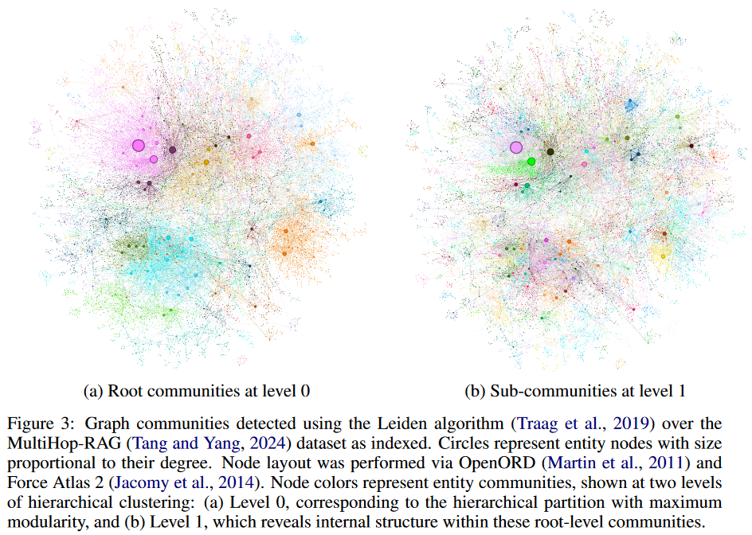

## Approach and pipeline

### Source Documents $\rarr$ Text Chunks

Longer text chunks require fewer LLM calls for such extraction, but suffer from the recall degradation of longer LLM context windows.

### Text Chunks $\rarr$ Element Instances

**Identify and extract instance of graph nodes and edges** from each chunk of source text.

1. Identify all **entities** in the text, including their name, type, and description.
2. Identify all **relationships** between clearly-related entities, including the source and target entities and a description of their relationship.
3. **Output** both kinds of element instance in **a single list of delimited tuples**.

* **Multiple rounds of "gleanings"** (up to a specified maximum)

    Encourage the LLM to detect any additional entities it may have missed on prior extraction rounds.

    This is a multi-stage process in which we first ask the LLM to access whether all entities were missed, then a continuation indicating that "MANY entities were missed in the last extraction" encourages the LLM to glean these missing entities.

    This approach allows us to use larger chunk sizes without a drop in quality or the forced introduction of noise (to balance the needs of efficiency and quality).

### Element Instances $\rarr$ Element Summaries

Convert all instance-level summaries (i.e., entity node, relationship edge, and claim covariate) into single blocks of descriptive text.

* Potential concern and solution

    The LLM may not consistently extract references to the same entity in the same text format, resulting in duplicate entity elements and thus duplicate nodes in the entity graph.

    Since All closely-related "communities" of entities will be detected and summarized in the following step, and the LLMs can understand the common entity behind multiple name variations, Our overall approach is resilient to such variations.

* Superiority

    The use of ==rich descriptive text== for homogeneous nodes in a potentially noisy graph structure, is aligned with both the capabilities of LLMs and the needs of global, query-focusd summarization.

    Differentiate our graph index from ==typical knowledge graph, which rely on concise and consistent knowledge triples (subject, predicate, object)== for downstream reasoning tasks.

### Element Summaries $\rarr$ Graph Communities

1. Use the index created in the previous step to model as an homogeneous undirected weighted graph. (edges: relationship, edge weights: the normalized counts of detected relationship instances)
2. Partition the graph into communities of nodes by a variety of community detection algorithms. (The nodes in the communities with stronger connections to one another than to other nodes in the graph)

* In our pipeline, we use ==[Leiden](#Leiden)== on account of its ability to recover hierarchical community structure of large-scale graph efficiently.

    

    Each level of this hierarchy provides a community partition that covers the nodes of the graph in a mutually-exclusive, collective-exhaustive way (相互排斥、集体穷举的方式), enabling divide-and-conquer global summarization.

### Graph Communities $\rarr$ Community Summaries

Create report-like summaries of each community in the Leiden hierarchy, using a method designed to scale to very large datasets.

* Community Summaries

    These summaries are independently useful in their own right as a way to understand the global structure and   semantics of the dataset.

    And may themselves be used to make sense of a corpus in the absence of a question.

* Steps

    * *Leaf-level communities.* 

        The element summaries of a leaf-level communities (nodes, edges, covariates) are prioritized and then iteratively added to the LLM context window until the token limit is reached.

        The prioritization is as follows: for each community edge in decreasing order of combined source and target node degree, add description of the source node, target node, linked covariates, and the edge itself.

    * *Higher-level communities.* 

        If all element summaries fit within the token limit of the context window, proceed as for leaf-level communities and summarize all element summaries within the community.

        Rank sub-communities in decreasing order of element summary tokens and iteratively substitute sub-community summaries (shorter) for their associated element summaries (longer) until fit within the context window is achieved.

### Community Summaries $\rarr$ Community Answers $\rarr$ Global Answer

Given a user query, the community summaries generated in the previous step can be used to generate a final answer in a multi-stage process. 由于社区具有层次性，questions can be answered using the community summaries from different levels, 这也意味着 raising the question of whether a particular level in the hierarchical community structure offers the best balance of summary detail and scope for general sensemaking questions.

* Steps

    * Prepare community summaries.

        Randomly shuffle community summaries and divide them into chunks of pre-specified token size.

        This ensures relevant information is distributed across chunks, rather than concentrated (and potentially lost) in a single context window.

    * Map community answers.

        Generate intermediate answers in parallel, one for each chunk.

        The LLM is also asked to generate a score between 0-100 indicating how helpful the generated answer is in answering the target question.

        Answers with score 0 are filtered out.

    * Reduce to global answer.

        Intermediate community answers are sorted in descending order of helpfulness score and iteratively added into a new context window until the token limit is reached. 

        The final context is used to generate the global answer returned to the user.

## Evaluation

### Metrics

GraphRAG的特性

* multi-stage
* the multiple condition we wanted to compare
* the lack of gold standard answer to our activity-based sensemaking question

Adopt a head-to-head comparison approach using an LLM evaluator. Select 3 target metrics capturing qualities that are desirable for sensemaking activities, as well as a control metric (directness) used as a indicator of validity.

* Comprehensiveness. 涵盖问题的各个方面和细节

    How much detail does the answer provide to cover all aspects and details of the question?

* Diversity. 对问题不同视角的见解

    How varied and rich is the answer in providing different perspectives and insights on the question? 

* Empowerment. 帮助读者理解，并对话题做出明智的判断

    How well does the answer help the reader understand and make informed judgements about the topic?

* Directness. 具体而清晰

    How specifically and clearly does the answer address the question?

## Leiden: A community detection algorithm

* Communities: nodes cluster and form relatively dense groups

* Three phases

    * local moving of nodes

        The Leiden algorithm uses a fast local move procedure in this phase.

        visit the nodes whose neighbourhood has changed

        1. Initialize a queue with all nodes in the network. The nodes are added to the queue in a random order.
        2. Remove the first node from the front of the queue and determine whether the quality function can be increased by moving this node from its current community to a different one.
            * If we add to the rear of the queue all neighbours of the node that do not belong to the node's new community and that are not yet in the queue.
        3. Keep removing nodes from the front of the queue, possibly moving these nodes to a different community.

    * refinement of the partition

        the partition $\cal{P}$ : result from the local moving phase. 

        To identify a partition $\cal{P}_{\rm{refined}}$ that is a refinement of $\cal{P}$. Communities in $\cal{P}$ may be split into multiple subcommunities in $\cal{P}_{\rm{refined}}$.

        1. Initially, $\cal{P}_{\rm{refined}}$ is set to a singleton partition, in which each node is in its own community.

        2. Locally merges nodes in $\cal{P}_{\rm{refined}}$: nodes that are on their own in a community in $\cal{P}_{\rm{refined}}$ can be merged with a different community. 

            Importantly, merges are performed only within each community of the partition in $\cal{P}_{\rm{refined}}$.

            In addition, a node is merged with a community in $\cal{P}_{\rm{refined}}$ only if both are sufficiently well connected to their community in $\cal{P}$.

        After the refinement phase is concluded, communities in $\cal{P}$ often will have been split into multiple communities in $\cal{P}_{\rm{refined}}$, but not always.

        In the refinement phase, nodes are not necessarily greedily merged with the community that yields the largest increase in the quality function. Instead, a node may be merged with any community for which the quality function increases. The larger the increase in the quality function, the more likely a community is to be selected. 

        The community with which a node is merged is selected randomly (The degree of randomness in the selection of a community is determined by a parameter $\theta > 0$). Randomness in the selection of a community allows the partition space to be explored more broadly. It can be shown that even when node mergers that decrease the quality function are excluded, the optimal partition of a set of nodes can still be uncovered (This is not the case when nodes are greedily merged with the community that yields the largest increase in the quality function).

    * aggregation of the network based on the refine partition

        The aggregate network is created based on the partition $\cal{P}_{\rm{refined}}$. However, the initial partition for the aggregate network is based on $\cal{P}$.

        

    

* Guarantees

    $\gamma$ : refer to the resolution parameter in the resolution parameter in the quality function that is optimised, which can be either modularity or CPM.

    After each iteration of the Leiden algorithm, it is guaranteed that:
    
    1. All communities are $\gamma$-separated.
    
        The property of $\gamma$-separation states that there are no communities that can be merged.
    
    2. All communities are $\gamma$-connected.
    
        The property of $\gamma$-connectivity is a slightly stronger variant of ordinary connectivity.
    
    3. All nodes are locally optimally assigned.
    
        There are no individual nodes that can be moved to a different community.
    
    4. All communities are subpartition $\gamma$-dense.
    
        A community is subpartition $\gamma$-dense if it can be partitioned into two parts such that: 
    
        (1) the two parts are well connected to each other;
    
        (2) neither part can be separated from its community;
    
        (3) each part is also subparition $\gamma$-dense itself.
    
        Subpartition $\gamma$-density does not imply that individual nodes are locally optimally assigned. It only implies that individual nodes are well connected to their community.
    
    5. All communities are uniformly $\gamma$-dense.
    
        Uniform $\gamma$-density means that no matter how a community is partitioned into two parts, the two parts will always be well connected to each other. Furthermore, if all communities in a partition are uniformly $\gamma$-dense, the quality of the partition is not too far from optimal.
    
    6. All communities are subset optimal.
    
        A community is subset optimal if all subsets of the community are locally optimally assigned. That is, no subset can be moved to a different community.
    
    
