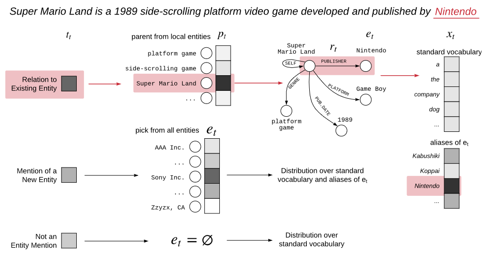

## KGLM 2019

Traditional language models

* only capable of remembering facts seen at training time, and often have differently recalling them. 
* unable to generate factually correct sentences, do not generalize to rare/unseen entities, and often omit rare tokens from the vocabulary (instead generating UNKNOWN tokens)
* existing models represent the distribution over the entire vocabulary directly, whether they are common words, references to real world entities, or factual information like dates and numbers.

To address this, we introduce the knowledge graph language model (KGLM),

* a neural language model with mechanisms for selecting and copying facts from a knowledge graph that are relevant to the context. 
* is conditioned on an external, structured knowledge source, which it uses to generate factual text.
* These mechanisms enable the model to render information it has never seen before, as well as generate out-of-vocabulary tokens
* KGLM maintains a dynamically growing *local knowledge graph*, a subset of the knowledge graph that contains entities that have already been mentioned in the text, and their related entities.
    * When generating entity tokens, the model either decides to render a new entity that is absent from the local graph, thereby growing the local knowledge graph, or to render a fact from the local graph.
    * When rendering, the model combines the standard vocabulary with tokens available in the knowledge graph, thus supporting numbers, dates, and other rare tokens.

### Problem Setup and Notation

* A language model
    * defines a probability distribution over each other within a sequence, conditioned on the sequence of tokens observed so far.
    * We denote the random variable representing the next token as $x_t$ and the sequence of the tokens before $t$ as $x_{<t}$. i.e. language models compute $p(x_t|x_{<t})$.
    * We use LSTMs as the recurrent module in this paper.
* A knowledge graph
    * is a directed, labeled graph consisting of entities $\mathcal{E}$ as nodes, with edges defined over a set of relations $\mathcal{R}$, i.e. $\mathcal{KG} = {(p, r, e|p \in \mathcal{E}, r \in \mathcal{R}, e \in \mathcal{E})}$, where p is a parent entity with relation $r$ to another entity $e$.

### Generative KG Language Model

* To encourage the model to generate facts that have appeared in the context already, KGLM will maintain a local knowledge graph containing all facts involving entities that have appeared in the context.
* As the model decides to refer to entities that have not been referred to yet, it will grow the local knowledge graph with additional entities and facts to reflect the new entity.
* Formally, we will compute $p(x_t, \mathcal{E}_t|x_{<t}, \mathcal{E}_{<t})$ where $x_{<t}$ is the sequence of observed tokens, $\mathcal{E}_{<t}$ is the set of entities mentioned in $x_{<t}$, and $\mathcal{KG}_{<t}$ is the local knowledge graph determined by $\mathcal{E}_{<t}$.

>* If $t_t$ = new then choose the upcoming entity $e_t$ from the set of all entities $\mathcal{E}$
>* If $t_t$ = related then:
>    - Choose a parent entity $p_t$ from $\mathcal{E}_{<t}$
>    - Choose a factual relation $r_t$ to render, $r_t \in \{(p, r, e) \in \mathcal{KG}_{<t} | p = p_t\}$
>    - Choose $e_t$ as one of the tail entities, $e_t \in \{e_t | (p_t, r_t, e) \in \mathcal{KG}_{<t} \}$
>* If $t_t = \empty$ then $e_t = \empty$
>* Generate $x_t$ conditioned on $e_t$, potentially copying one of $e_t$'s aliases.
>* If $e_t \notin \mathcal{E}_{<t}$, then ${\mathcal{<(t+1)} \larr \mathcal{E}_{<t}\; \cup \;\{e_t\}}$, else ${\mathcal{E}_{t+1} \larr \mathcal{E}_{<t}}$

For the model to refer to an entity it has already mentioned, we introduce a *Reflexive* relation that self-relates, i.e. $p = e$ for ($p$, Reflexive, $e$).

### Parameterizing the Distributions

## EMAT 2022

* The main architectural innovation is to use an external knowledgebase, based on RAG, and combine this seamlessly with a memory mechanism to improve the model's predictive performance. The main structure of this model is to use a question and document encoder, both transformer, to learn and look up passages of text from a knowledgebase. (based on DPR) and then fuse this knowledge into a transformer encoder/decoder model such as BERT and T5.
* The model retrieves $n$ passages, performs a lookup in both the KB and memory and then reranks them together using the dot product score between the question and document encoder vectors. (A significant benefit is that it naturally integrates both a short-term and long-term KB retrieval mechanism with a relatively simple design while allowing a powerful pre-trained LM and retrieval system from RAG to be trained.)

