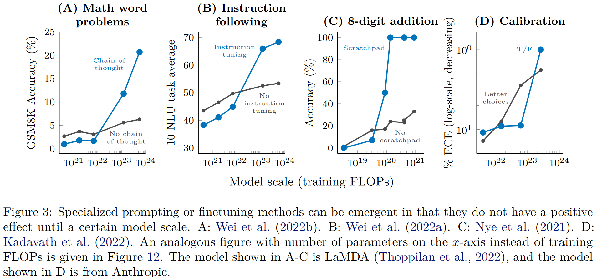

Paper: https://openreview.net/forum?id=yzkSU5zdwD

Cite as: Wei J, Tay Y, Bommasani R, et al. Emergent Abilities of Large Language Models[J]. Transactions on Machine Learning Research, 2022.

## What

==Emergent ability of large language model==: An ability is emergent if it is not present in smaller models but is present in larger models.

Emergent abilities would not have been directly predicted by extrapolating a scaling law from small-scale models.

When visualized via a scaling curve (x-axis: model scale, y-axis: performance), emergent abilities show a clear pattern: performance is near-random until a certain critical threshold of scale is reached, after which performance increases to substantially above random.

Today's language models have been scaled primarily along three factors:

* amount of computation
* number of model parameters
* training dataset size

Overall, it may be wise to view emergence as a function of many correlated variables.

Note that the scale at which an ability is first observed to emerge depends on a number of factors and  is not an immutable property of the ability.

Our goal in this paper is not  to characterize or claim that a specific scale is required to observe emergent abilities, but rather, we aim to discuss examples of emergent behavior in prior work.

## Which

### Few-Shot Prompted Tasks

Emergent abilities in the *prompting* paradigm, as popularized by GPT-3.

In prompting, a pre-trained language model is given a prompt of a task and completes the response without any further training or gradient updates to its parameters. Brown et al. proposed *few-shot prompting*, which includes a few input-output examples in the model's context (input) as a preamble before asking the model to perform the task for an unseen inference-time example.

 The ability to perform a task via few-shot prompting is emergent when a model has random performance until a certain scale, after which performance increases to well-above random.

### Augmented Prompting Strategies

* Multi-step reasoning

    A recent prompting strategy called Chain-of-thought prompting enables language models to solve such problems by guiding them to produce a sequence of intermediate steps before giving the final answer.

    A similar emergence in performance gain was also observed when augmenting few-shot prompting with explanations that came after the final answer[^1].

* Instruction following

    Aim to better enable language models to perform new task simply by reading instructions describing the task (without few-shot examples). By finetuning on a mixture of tasks phrased as instructions, language models have been shown to respond appropriately to instructions describing an unseen task.

* Program execution 程序执行

    Nye et al. show that  finetuning language models to predict intermediate outputs ("scratchpad") enables them to successfully execute such multi-step computations.

* Model calibration 模型校准

    Calibration: measure whether models can predict which questions they will be able to answer correctly.

## Discussion

* Potential explanations of emergence

    Although there are dozens of examples of emergent abilities, there are currently few compelling explanations for why such abilities emerge in the way they do.

    It is also important to consider the evaluation metrics used to measure emergent abilities.

    Overall, more work is needed to tease apart what enables scale to unlock emergent abilities.

* Beyond Scaling

    Although we may observe an emergent ability to occur at a certain scale, it is possible that the ability could be later achieved at a smaller scale--in other words, model scale is not the singular factor for unlocking an emergent ability. As the science of training large language models processes, certain abilities may be unlocked for smaller models with new architectures, higher-quality data, or improved training procedures.

    Moreover, once an ability is discovered, further research may make the ability available for smaller scale models.

* Another view of emergence

    Scale need not be the only lens to view emergent abilities. Overall, emergent abilities should probably be viewed as a function of many correlated variables.

* Emergent risks

* Sociological changes

* Directions for future work

    * Further model scaling
    * Improved model architectures and training
    * Data scaling
    * Better techniques for and understanding of prompting
    * Frontier tasks
    * Understand emergence

[^1]: Lampinen A, Dasgupta I, Chan S, et al. Can language models learn from explanations in context?[C]//Goldberg Y, Kozareva Z, Zhang Y. Findings of the Association for Computational Linguistics: EMNLP 2022. Abu Dhabi, United Arab Emirates: Association for Computational Linguistics, 2022: 537-563.
