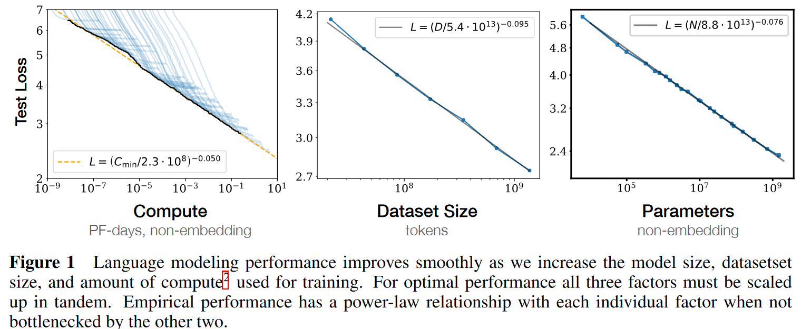

Paper: https://arxiv.org/abs/2001.08361

Cite as: Kaplan J, McCandlish S, Henighan T, et al. Scaling Laws for Neural Language Models[M]//arXiv e-prints. (2020-01-01).

## Why

Scaling laws for language model performance on the cross-entropy loss: The loss scales as a power-law with model's size, dataset size, and the amount of compute used for training, with some trends spanning more than seven orders of manitude.

## What

In this work we will empirically investigate the dependence of language modeling loss on model architecture, the size of neural network, the computing power used to train them, and the data available for this training process, focusing on the Transformer architecture.

### Summary

* Performance depends strongly on scale, weakly on model shape.

    Scale consists of three factors: the number of model parameters $N$ (excluding embeddings), the size of dataset $D$, and the amount of compute $C$ used for training.

    Architectural hyperparameters, such as depth vs. width.

* Smooth power laws.

    Performance has a power-law relationship with each of the three scale factors $N$, $D$, $C$ when not bottlenecked by the other two, with trends spanning more than six orders of magnitude.

* University of overfitting.

    Performance improves predictably as long as we scale up $N$ and $D$ in tandem, but enters a regime of diminishing returns if either $N$ or $D$ is held fixed while the other increases. The performance penalty depends predictably on the ratio $N^{0.74}/D$, meaning that every time we increase the model size 8x, we only need to increase the data by roughly 5x to avoid a penalty.

* Transfer improves with test performance.

    Transfer to a different distribution incurs a constant penalty but otherwise improves roughly  in line with performance on the training set.

* Sample efficiency.

    Large models reach the same level of performance with fewer optimization steps and use fewer data points than small models do.

* Convergence is inefficient.

    training very large models and stopping significantly short of convergence

    Maximally compute-efficient training would therefore be far more sample efficient than one might expect based on training small models to convergence.

    Data requirements grow very slowly as $D \sim C^{0.27}$ with training compute.

* Optimal batch size.

    The ideal batch size for training these models is roughly a power of the loss only, and continues to be determinable by measuring the gradient noise scale.

### Summary of Scaling Laws

The test loss of a Transformer trained to autoregressively model language can be predicted using a power-law when performance is limited by only either the number of non-embedding parameters $N$ , the dataset size $D$, or the optimally allocated compute budget $C_{min}$.

1. For models with a limited number of parameters, trained to convergence on sufficiently large datasets:
    $$
    L(N) = (N_c/N)^{\alpha_D}; \; \alpha_N \sim 0.076, \; N_c \sim 8.8 \times 10^{13}\rm{(non-embedding\;parameters)}
    $$

2. For large models trained with a limited dataset with early stopping:
    $$
    L(D) = (D_c/D)^{\alpha_D}; \; \alpha_D \sim 0.095, \; D_c \sim 5.4 \times 10^{13} \rm{(tokens)}
    $$

3. When training with a limited amount of compute, a sufficiently large dataset, an optimally-sized model, and a sufficiently small batch size (making optimal3 use of compute):
    $$
    L(C_{min}) = (C^{min}_c/C_{min})^{\alpha^{min}_C} ; \; \alpha^{min}_C \sim 0.050, \; C^{min}_c \sim 3.1 \times 10^8 \rm{(PF-days)}
    $$

4. 

The power laws $\alpha_N$, $\alpha_D$, $\alpha_C^{min}$ specify the degree of performance improvement expected  as we scale up $N$, $D$, or $C_{min}$.

The critical batch size, which determines the speed/efficiency tradeoff for data parallelism, also roughly  obeys a power law in $L$:
$$
B_{\rm{crit}}(L) = \frac{B_*}{L^{1/\alpha_B}}, \; B_* \sim 2\;\cdot10^8\;\rm{token}, \; \alpha_B \sim 0.21
$$
There is a single equation combining (1.1) and (1.2) that governs the simultaneous dependence on $N$ and $D$ and governs the degree of overfitting:
$$
L(N, D) = \left[ \left( \frac{N_c}{N} \right)^{\frac{\alpha_N}{\alpha_D}} + \frac{D_c}{D} \right]^{\alpha_D}
$$
When training a given model for a finite number of parameter update steps $S$ in the infinite data limit, after an initial transient period, the learning curves can be accurately fit by:
$$
L(N, S) = \left(\frac{N_c}{N}\right)^{\alpha_N} + \left(\frac{S_{c}}{S_{min}(S)}\right)
$$

## How

Throughout we will observe precise power-law scalings for performance as a function of training time, context length, dataset size, model size, and compute budget.

