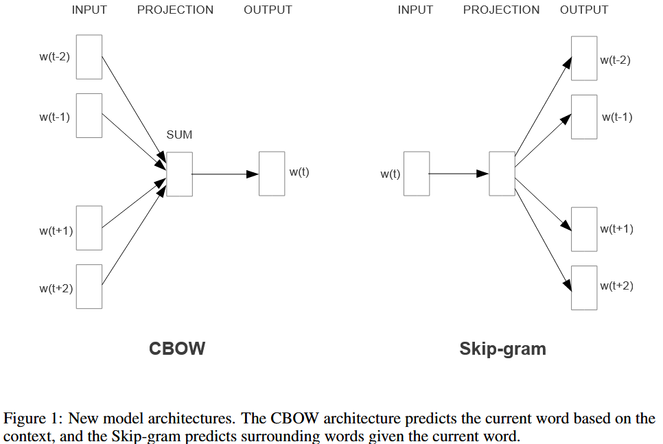

## treat ords as atomic units - no notion of similarity between words

* simplicity, robustness and simple models trained on huge amounts of data outperform complex systems trained on less data.
* Example: N-grams model
* In recent years, it has become possible to train more complex models on much large data set, and they typically outperform the simple models.

## Word2Vec

* introduce techniques that can be used for learning high-quality word vectors form huge data sets with billions of words, and with millions of words in the vocabulary.

    None of the previously proposed architectures has been successfully trained on more than a few hundred of millions of words, with a modest dimensionality of the word vectors between 50-100.

    Focus on distributed representations of words learned by **neural networks**, as they perform better than LSA (Latent Semantic Analysis); LDA (Latent Dirichlet Allocation) becomes computationally expensive on large data sets.

    

* Continuous Bag of Words Model (CBOW)

    The architecture is similar to the feedforward NNLM, where the non-linear hidden layer is removed and the projection layer is shared for all words (not just the projection matrix); thus, all words get projected into the same position (their vectors are averaged).

    The order of words in the history does not influence the projection.

    Also use words from the future.

    Build a log-linear classifier with four future and four history words at the input, where the trianing criterion is to correctly classify the current (middle) word.

    The weight matrix between the input and the projection layer is shared for all word positions in the same way as in the NNLM.

* Continuous Skip-gram Model

    * Given a sequence of training words $w_1, w_2, ..., w_T$ , the objective of the Skip-gram model is to maximize the average log probability
        $$
        \frac{1}{T}\sum\limits^T_{t=1}\sum\limits_{-c\le j\le c,j\neq 0}log\;p(w_{t+j}|w_t)
        $$
        where $c$ is the size of the training context (which can be a function of the center word $w_t$).

    * The basic Skip-gram formulation defines $p(w_{t+j}|w_t)$ using the softmax function:
        $$
        p(w_O|w_I) = \frac{exp({v'_{w_O}}^Tv_{w_I})}{\sum_{w=1}^W exp({v'_{w_O}}^Tv_{w_I})}
        $$
        where $v_w$ and $v'_w$ are the "input" and "output" vector representations of $w$, and $W$ is the number of words in the vocabulary. 这个公式是不切实际的？？？

    Instead of predicting the current word based on the context, it tries to maximize classification of a word based on another word in the same sentence. 试图根据同一个句子中的另一个词最大化地对一个词进行分类

    More precisely, we use each current word as an input to a log-linear classifier with continuous projection layer, and predict words within a certain range before and after the current word. 将每个当前此输入到具有连续投影层的对数线性分类其中，并在当前词前后一定范围内预测词

    Increasing the range improves quality of the resulting word vectors.

    Since the more distant words are usually less related to the current word than those close to it, we give less weight to the distant words by sampling less from those words in our training examples.

## 对 Skip-gram 的优化

* Word representations are limited by their inability to represent idiomatic phrases that are not compositions of the individual words. 词的表征受限于它们不能表征不是单个词组成的惯用语

    For example, "Boston Globe" is a newspaper, and so it is not a natural combination of the meanings of "Boston" and "Globe".

    We first find words that appear frequently together, and infrequently in other contexts, and then replaced by unique tokens in the training data.

* Present several extensions of the original Skip-gram model.

    * Subsample of frequent words during training results in a significant speedup, and improves accuracy of the representations of less frequent words.

* Present a simplified variant of Noise Contrastive Estimation (NCE) for training the Skip-gram model that results in faster training and better vector representations for frequent words.

* The extension from word based to phrase based models

    * identify a large number of phrases using a data-driven approach 使用数据驱动方法识别大量短语
    * treat the phrases as individual tokens during the training 在训练过程中将短语视为个体标记

### Hierarchical Softmax

A computationally efficient approximation

The hierarchical softmax uses a binary tree representation of the output layer with the $W$ words as its leaves and, for each node, explicity represents the relative probabilities of its child nodes. These define a random walk that assigns probabilities to words.

Use a ==binary Huffman tree==, as it assigns short codes to the frequent words which results in fast training.

### Negative Sampling

An alternative to the hierarchical softmax is NCE.

The Skip-gram model is only concerned with learning high-quality vector representations, 所以我们对NCE进行了简化，define Negative sampling (NEG) by the objective
$$
log\;\sigma({v'_{w_O}}^T v_{w_I}) + \sum\limits^k_{i=1}\mathbb{E}_{w_i \sim P_n(w)}[log\;\sigma({-v'_{w_O}}^T v_{w_I})]
$$
which is used to replace every $log(w_O|w_I)$ term in the Skip-gram objective.

The task is to distinguish the target word $w_O$ from draws from the noise distribution $P_n(w)$ using logistic regression, where there are $k$ negative samples for each data sample.

The main difference between the Negative sampling and NCE is that NCE does needs both samples and the numerical probabilities of the noise distribution, while Negative sampling uses only samples.

### Subsampling of Frequent Words

The frequent words (e.g., "in", "the", and "a") usually provide less information value than the rare words. The vector representations of frequent words do not change significantly after training on several million examples.

To counter the imbalance between the rare and frequent words, use subsampling approach: each word $w_i$ in the training set is discarded with probability computed by the formula
$$
P(w_i) = 1 - \sqrt{\frac{t}{f(w_i)}}
$$
where $f(w_i)$ is the frequency of word $w_i$ and $t$ is a chosen threshold, typically around $10^{-5}$.

It aggressively subsamples words whose frequency is greater than $t$ while preserving the ranking of the frequencies.

Significantly improves the accuracy of the learned vectors of the rare words.

## Spherical Text Embedding

Current procedures of training text embeddings in the Euclidean space and using their similarities in the spherical space result in a gap between the training stage and usage stage of text embedding. After projecting the embedding from Euclidean space to spherical space, the optimal solution to the loss function in the original space may not remain optimal in the new space. 将embedding从欧几里得空间投影到球面空间后，原始空间中损失函数的最优解在新空间中可能不再保持最优

jointly learn unsupervised word and paragraph embeddings

develop an efficient optimization algorithm with convergence guarantee based on Riemannian optimization

### Embedding Model

* The Generative Model
    * Assume text generation is a two-step process
        * A center word is first generated according to the semantics of the paragraph
        * The surrounding words are generated based on the center word's semantics
    * Assume the direction in the spherical embedding space captures textual semantics and higher directional similarity implies higher co-occurrence probability.
* Objective
